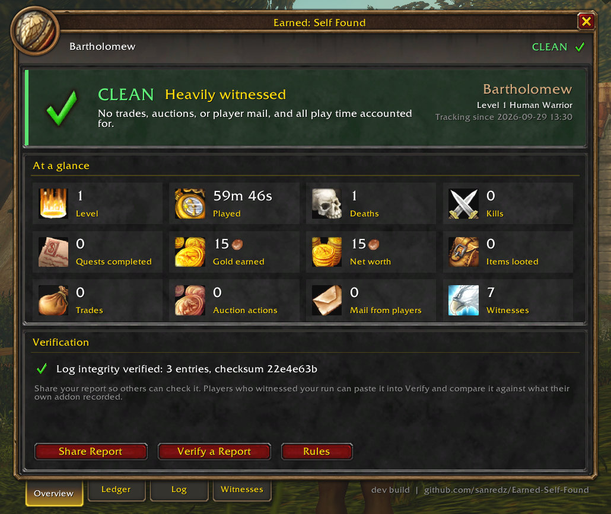
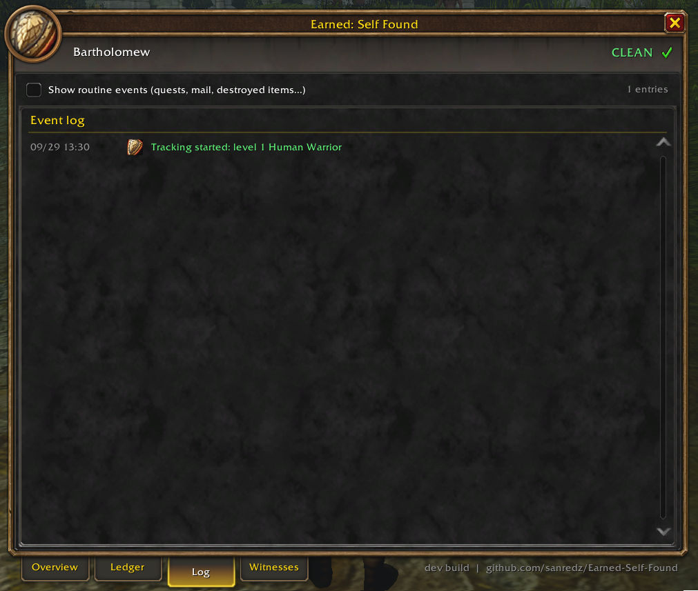
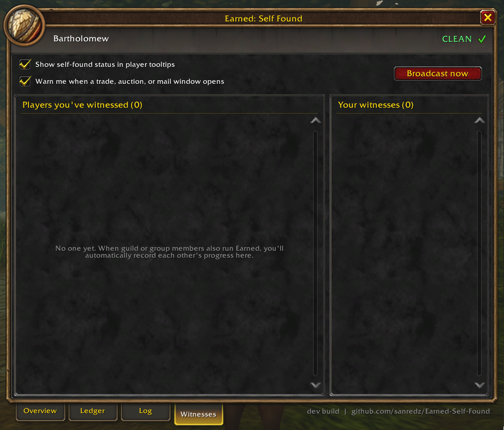
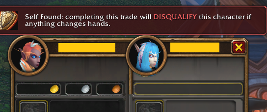
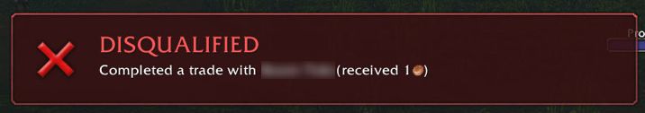

# Earned: Self Found

[](https://github.com/sanredz/Earned-Self-Found/actions/workflows/ci.yml)

A **self-found** tracker for **World of Warcraft: Forever**. Everything
your character owns, it earned: no trading, no auction house, no mail from
other players. The addon enforces the rules, keeps a detailed ledger of your
run, and lets other players vouch for it.

> **Official download:** this repository's
> [Releases](https://github.com/sanredz/Earned-Self-Found/releases). Copies
> uploaded anywhere else aren't official and may be modified.



## Features

- **Run status:** CLEAN, UNVERIFIED or DISQUALIFIED, shown in the window, on
  the minimap button, and in player tooltips.
- **Rule enforcement:** breaking a rule disqualifies the run immediately, with
  an on-screen alert. A warning banner appears whenever a trade, auction, mail
  or bank window is open.
- **Gold ledger:** income by source (looted gold, quests, vendor sales, mail
  and auctions) and spending by category (vendors, repairs, training, flights,
  fees).
- **Net worth:** gold plus the vendor value of your bags, equipped gear and
  bank, with your all-time peak.
- **Stats:** deaths, kills, quests, items looted, sold and destroyed, trades,
  auction house visits.
- **Event log:** a checksum-chained history of your run.
- **Witnesses:** players running the addon in your guild or group
  automatically record each other's progress. Sharing is always on, so a run
  can't quietly go dark. Only your status, level, played time, deaths, quest
  count, class and number of violations are shared, and only with guild and
  group members running the addon.
- **Check any player:** search for a player (or click one) to see everything
  your addon recorded of them, and ask every other witness in your guild and
  group what theirs recorded.
- **Online without Earned:** if someone who runs the addon is online but
  their addon goes quiet, witnesses notice and record it.
- **Share and verify:** export a report anyone can paste into Verify, which
  checks it against their own witness records.

<p>
  
  
</p>

## Rules

**Disqualifies the run:**
- Completing a trade where any item, gold or enchant changes hands (opening
  or cancelling a trade is fine).
- Bidding on, buying out or listing an auction.
- Taking items or gold (including COD) from mail sent by another player. Your
  own returned mail, NPC mail and auction house mail are fine.
- Withdrawing items or gold from a guild bank or Warband bank.
- Editing the addon's saved data outside the game.

A warning appears before you can break a rule by accident:



Breaking one disqualifies the run on the spot:



**Marks the run Unverified:**
- Play time the addon didn't see (it was disabled or uninstalled, or the game
  crashed). It's checked against the server's `/played`.
- Installing the addon on a character that already had play time.

Grouping is allowed, and encouraged (see below).

### Disconnects

After a disconnect, the server keeps your character in the world for a
short while, and `/played` keeps counting. That idle time (up to 3 minutes)
is forgiven if your character is exactly as it was: same gold, level, XP,
bags and gear. It's noted in the log.

The other way around, time the addon didn't see counts **even if it's
short** when the character changed in it. Your bank is checked too: it can
only change while it's open, so if it ever differs from how the addon last
saw it, the run becomes Unverified.

## Witnesses: how other players vouch for you

Your own saved data lives on your computer, so on its own it proves little.
Witnesses fix that. It's all automatic:

1. Everyone running Earned in your **guild or group** sends a tiny, invisible
   status update every minute: status, level, played time, deaths.
2. Each addon keeps what it heard. **Players you've witnessed** are the ones
   your addon recorded. **Your witnesses** are the ones whose addons recorded
   you.
3. Those records sit on *other people's* computers, so nobody can fake or
   erase what their witnesses saw.

Sharing is always on, so a run can't quietly go dark. Only status, level,
played time, deaths, quest count, class and number of violations are shared,
and only with guild and group members running the addon.

**Join a guild made for Earned and self-found players.** More witnesses
online means crashes get recovered, and your run is vouched for by more
people.

### Checking a player

Open the **Witnesses** tab and type a name in the search box (suggestions
appear as you type), click any player in the lists, or use `/sf check <name>`.
The profile shows:
- **What their addon says:** status and witness rating.
- **What you've seen:** a timeline of every status you recorded, and any
  time they were online without Earned running.
- **Other witnesses:** click **Ask witnesses**, and everyone in your guild
  and group who runs Earned replies with what their addon recorded, e.g.
  "5 of 5 last saw them CLEAN" or "1 saw a disqualification".

A player can fake their own addon, but not what everyone else's recorded.
Use **My profile** to see what others recorded of you.

### Online without Earned

A disabled addon can't warn anyone itself, but its silence is the signal. If
someone known to run Earned is online in your guild or group and their addon
sends nothing for 5 minutes, your addon records it. It's shown in their
profile, the lists and their tooltip.

### Crashes are recovered

The game only saves addon data when you log out or `/reload`, so a hard crash
loses the play time since then, which on its own makes a run Unverified. But
witnesses heard from your addon every minute:
- After a crash, your addon asks them when they last heard from you.
- If it was right up until the crash (within about 90 seconds of play time),
  it was a crash and not play without the addon, and the run stays
  **CLEAN**.
- Each recovery lists the witnesses who confirmed it.

### Witness rating

Next to your status you'll see how well other players can vouch for your
run, e.g. **CLEAN · Well witnessed**:

| Rating | Share of your play time witnessed | Different witnesses |
|---|---|---|
| Unwitnessed | less than 10% | |
| Lightly witnessed | 10%+ | 1+ |
| Well witnessed | 40%+ | 3+ |
| Heavily witnessed | 75%+ | 5+ |

If a witness ever proved you broadcast a disqualification before a crash,
it shows next to the rating as "(1 disputed)". It's never enforced
automatically.

### Nobody can grief you

- Your status is only ever changed by **your own addon seeing your own
  actions**. Other players can help recover a crash, but can never
  disqualify you or make you Unverified.
- Messages only count on the channels they're really sent on, and only from
  players seen in your guild or group.
- Every status update carries a token made from a secret key that never
  leaves your computer. Crash sightings must echo a real token, so nobody can
  make one up.
- What witnesses tell you when you ask about a player is shown with their
  names and counts ("4 of 5…"), as information, never as a verdict.

## Install

1. Download the latest `EarnedSelfFound-vX.Y.Z.zip` from
   [Releases](https://github.com/sanredz/Earned-Self-Found/releases).
2. Extract it into `World of Warcraft\_classic_beta_\Interface\AddOns\`. You
   should end up with an `AddOns\EarnedSelfFound` folder.
3. Install it **before** you start the character. A run that starts later is
   marked Unverified.

## Commands

| Command | |
|---|---|
| `/sf` | Open or close the window |
| `/sf status` | Print your run status |
| `/sf share` | Export your report |
| `/sf verify` | Verify someone else's report |
| `/sf check <name>` | Open a player's profile (just `/sf check` for your own) |
| `/sf minimap` | Show or hide the minimap button |
| `/sf broadcast` | Send your status to guild and group now |
| `/sf preview` | Preview the disqualification alert and a sample dispute. Nothing is saved or shared; type it again or `/reload` to turn it off. |

## How trustworthy is it?

No addon can be made cheat-proof. Addons can't reach the internet, and
their code and saved data sit on the player's computer. Earned makes cheating
**detectable** and **costly**:

- The event log is hash-chained and all saved data is sealed. Editing the file
  by hand is detected and disqualifies the run.
- While you play, the addon works on a private copy of its data that chat
  commands (`/run`) can't reach. Every 15 seconds it saves a sealed copy, so
  a disconnect loses almost nothing, and chat edits to that copy are either
  overwritten or caught as tampering.
- Your status is sent to witnesses the moment a violation happens. Those
  records live on *their* computers, so deleting or editing your own data
  doesn't erase what they saw.
- Play time is compared against the server's `/played`, so time played with
  the addon disabled shows up.

A player who modifies the addon itself can still lie, and a friend with a
modified addon could vouch for a fake crash. The more witnesses a run has, the
harder that is to hide, which is why every recovery shows who confirmed it.

## Development

```
EarnedSelfFound.toc  Addon manifest (load order, saved variables)
Core.lua             Namespace, events, formatting, serializer and checksum
Ledger.lua           Saved run data, the chained log, seal and run status
Tracker.lua          Gold, items, kills, quests, deaths, play time, net worth
Rules.lua            Disqualification rules, alerts and warning banners
Witness.lua          Heartbeats between players, crash recovery, rating, reports
Profiles.lua         "Online without Earned" detection, asking other witnesses
UI.lua               Main window, dialogs, slash commands
ProfileUI.lua        Player profile window
Minimap.lua          Minimap button
tests/               Test harness (Lua VM in Node with stubbed WoW APIs)
scripts/             Dev helpers
```

**Setup (once):**

```bash
npm install
```

```powershell
powershell -ExecutionPolicy Bypass -File scripts\link-addon.ps1
```

The script links `Interface\AddOns\EarnedSelfFound` to this repo. Edit files here,
then `/reload` in game.

**Tests:** `npm test` runs a Lua 5.1 syntax check and a simulation of the
addon against stubbed WoW APIs, covering:
- the checksum against an independent reference
- tamper detection, `/played` gaps and every rule
- witnesses and reports
- every UI code path

CI runs the same tests on every push.

**Compatibility, don't break these:**
- the folder and TOC name (`EarnedSelfFound`) and saved variable names (`SelfFoundDB`,
  `SelfFoundCharDB`)
- the addon message prefix `SelfFound` and the `H1`/`A1` heartbeat format
- the report format (`SF1:`)
- anything that feeds the seal or log hashes

Changing them breaks existing runs or stops versions from witnessing each
other. If one must change, bump the MAJOR version and migrate.

### Releasing

1. Move the items under **Unreleased** in `CHANGELOG.md` to a new version
   heading.
2. Commit, then tag and push:
   ```bash
   git tag v1.1.0
   git push origin main --tags
   ```
3. GitHub Actions runs the tests, stamps the version into the TOC, and
   publishes `EarnedSelfFound-v1.1.0.zip` as a GitHub release.

To also publish to CurseForge or Wago:
1. Add `## X-Curse-Project-ID:` / `## X-Wago-ID:` to the TOC.
2. Add the `CF_API_KEY` / `WAGO_API_TOKEN` repository secrets.

## License

All rights reserved. Free to download and use; redistribution and modified
re-uploads aren't allowed. See [LICENSE](LICENSE).
